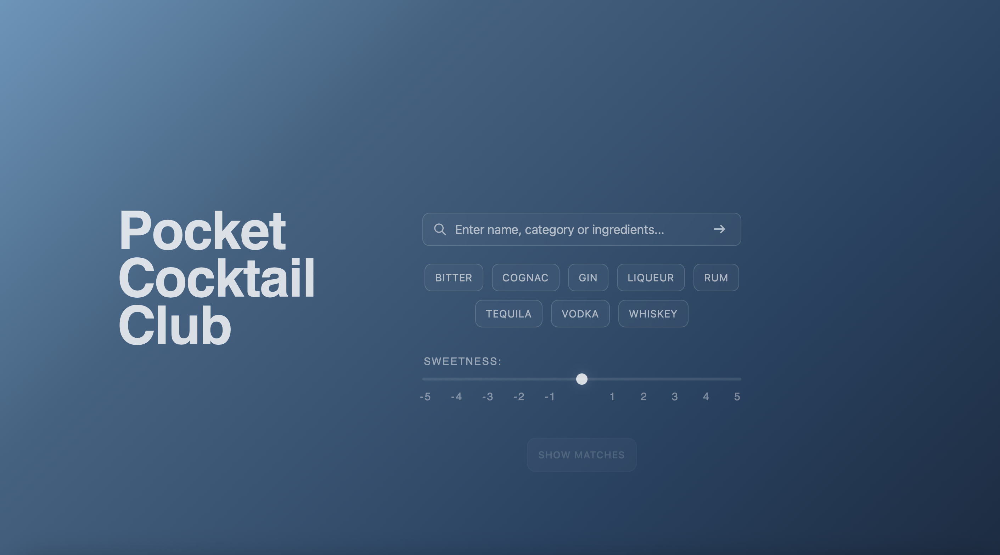

# [Pocket Cocktail Club] 🍸

  

Pocket Cocktail Club - a full-stack web application built with Java Spring Boot, MySQL and JavaScript.
It allows the user to easily find and discover new drink recipes based on different search terms or specific preferences.

 ⚠️ Note: This project is currently a Work in Progress as I continue to refine features and the design.

## ✨Functions
The application features multiple ways to find the perfect recipe:

* Smart Search: Find recipes by Name, Category (e.g. "Classic", "Sour") or list preferred ingredients.
* Interactive Taste Filter: Use the spirit quick-select buttons in combination with the dynamic Sweetness Slider to find drinks that matches both preferred base spirit and desired flavor profile (ranging from bitter to sweet).  
* Randomizer: Not sure what you are looking for? Enter the word "Random" and a surprise recipe will be presented.

## 🛠️ Tech Stack
* Backend: Java 25, Spring Boot (Spring Web Spring Data JPA)
* Database: MySQL
* Frontend: HTML5, CSS3, Vanilla JavaScript (ES6+)

## 📋 Requirements:
* JDK 25 or higher
* MySQL Server
* Maven (for dependency management)
* Modern Web Browser (Chrome, Firefox, Safari or Edge)

## 🚀 Installation & setup
To get the project running on your local machine follow these steps:

### 1. Clone the repository:
* git clone https://github.com/eeebbaandersson/pocket-cocktail-club.git

### 2. Database Configuration:
 * Create a MySQL database named cocktail_db. (It is important to use this exact name for the application to function correctly).
 * In src/main/resources/, create a file named application.properties.
 * Copy the content from application.properties.example into your new file.
 * Update the DATA_BASE_NAME to cocktail_db, and for USERNAME and PASSWORD use your local MySQL credentials.

### 3. Data Initialization
The application is designed to be plug-and-play:
* Schema: The app uses hibernate.ddl-auto=update, meaning Hibernate will automatically generate and update the database tables based on the Java entities.
* Data: Initial cocktail data is automatically imported from src/main/resources/drink_data.json on startup.
* Note: Manual execution of schema.sql is not required with current settings.

### 4. Run the Application
* Launch the project via IntelliJ IDEA or use the terminal: ./mvnw spring-boot:run.
* Once the terminal shows that the application has started, open your browser and navigate to http://localhost:8080.

