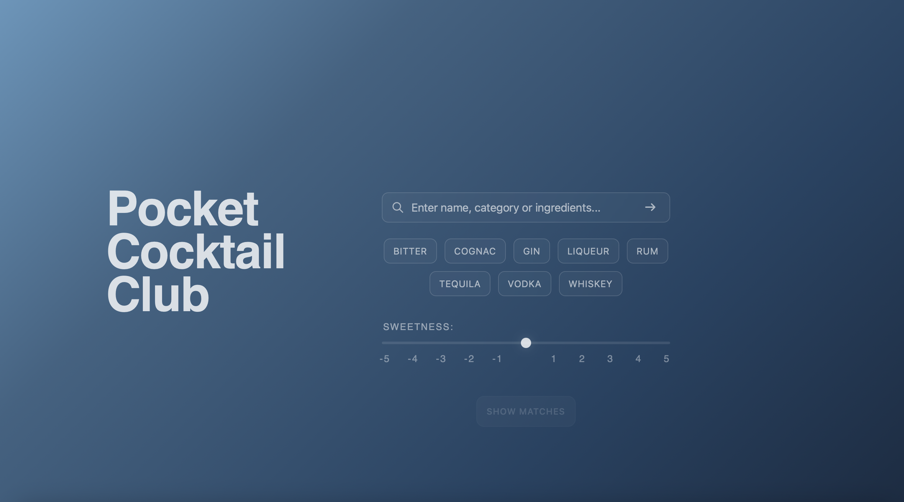
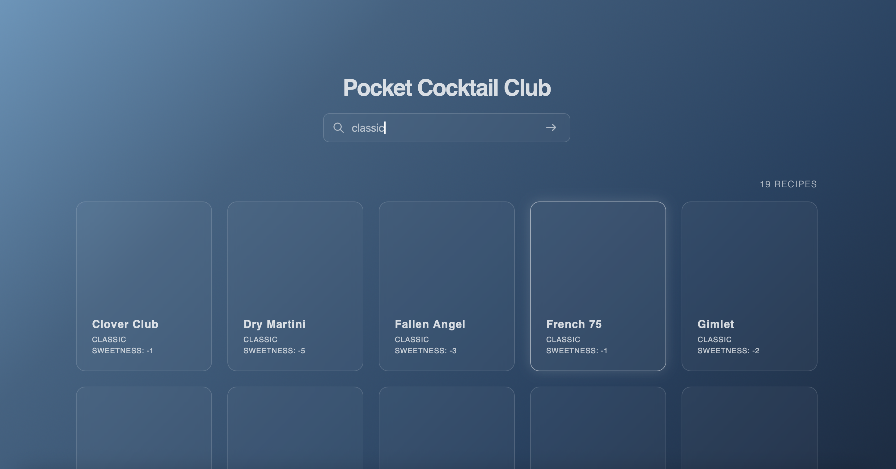
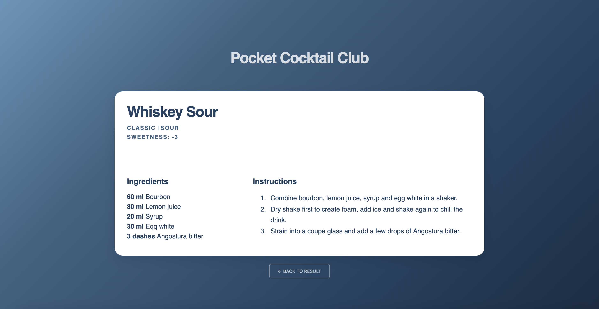

# [Pocket Cocktail Club] 🍸

<p align="center">



</p>

Pocket Cocktail Club is a full-stack web application built with **Java Spring Boot**, **MySQL** and **JavaScript**.
It allows the user to easily find and discover new drink recipes based on different search terms or specific preferences.

⚠️ **Note:** This project is currently a Work in Progress as I continue to refine features and the design.

---

## ✨ Features
The application features multiple ways to find the perfect recipe:

* **Smart Search:** Find recipes by Name, Category (e.g. "Classic", "Sour") or list preferred ingredients (separated by `,` ).
* **Interactive Taste Filter:** Use the spirit quick-select buttons in combination with a dynamic **Sweetness Slider** to find drinks that matches both preferred base spirit and desired flavor profile (ranging from bitter to sweet).
* **Randomizer:** Not sure what you are looking for? Enter "Random" to get a surprise recipe.

## 🛠️ Tech Stack
* **Backend:** Java 25, Spring Boot (Spring Web, Spring Data JPA)
* **Database:** MySQL
* **Frontend:** HTML5, CSS3, Vanilla JavaScript (ES6+)
* **DevOps:** Docker, Docker Compose, GitHub Actions (CI/CD)


## 📋 Requirements
* **Docker & Docker Desktop** (Recommended - runs everything with one command)
* **Alternative (Manual Setup):** JDK 25, MySQL Server, and Maven.

---

## 🚀 Installation & setup
To get the project running on your local machine, follow these steps:

### 1. Clone the repository
```bash
git clone https://github.com/eeebbaandersson/pocket-cocktail-club.git
cd pocket-cocktail-club
```

### 2. Run with Docker (Fastest Way ⚡️)
You don't need to manually configure a database or install Java. Docker handles everything, including networking and data initialization:
```bash
docker-compose up --build
```
* **Application:** http://localhost:8080
* **Database:** Runs in the background on port  `3306`.
* **Initialization:** Cocktail data is automatically imported from `drink_data.json` on the first startup.

---

### 3. Manual Setup 
If you prefer to run the project directly in your IDE (e.g., IntelliJ IDEA):
1. **Start the Database:** You can start just the MySQL container: docker-compose up db
2. **Configuration:** The app uses environment variables for the connection but has safe defaults (`root`/`root`) in `application.properties`.
3. **Run the Application:** Launch `DrinkApiApplication` in your IDE or use the terminal:
```bash
./mvnw spring-boot:run
```

## 📦 GitHub Packages & CI/CD
This project uses GitHub Actions for automated builds. Every time a new **Release** is published on GitHub, a Docker image is automatically built and pushed to the GitHub Container Registry (GHCR).
To pull the latest pre-built image:
```bash
docker pull ghcr.io/eeebbaandersson/drink-api:latest
```

## 🛠️ Data Initialization
The application is designed to be plug-and-play:
* **Schema:** Hibernate is set to `ddl-auto=update`, which automatically generates the database tables.
* **Data:** Initial cocktail data is imported from `src/main/resources/drink_data.json` automatically on startup.
* **Note:** Manual execution of `schema.sql` is not required.
