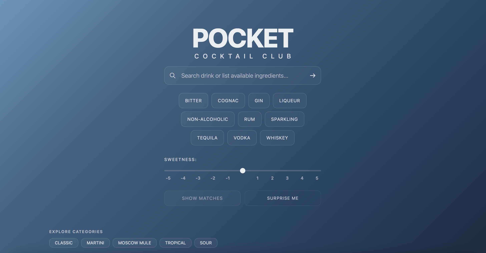

# 🍸 Pocket Cocktail Club 
**A curated guide for the home bartender or a night out.**

<p align="center">

</p>

**Pocket Cocktail Club** is a full-stack web application built with **Java Spring Boot**, **MySQL** and **JavaScript**.

Unsure what a "New York Sour" actually contains while standing at the bar? 
Look it up instantly before you order. Whether you're exploring nightlife or mixing drinks at home, this application allows you to find recipes based on preferences, available ingredients, or flavor profile.

⚠️ **Note –** This project is currently a Work in Progress.

---

## ✨ Key Features & User Guide

* **Search & Categories** – Filter recipes by name, base spirit, or categories (such as *Classic*, *Sour*, or *Martini*).
* **Ingredient Filter** – Enter available ingredients (separated by `,`) to find recipes you can make with what you have.
* **Flavor Compass** – Use the spirit buttons in combination with the sweetness slider (-5 to +5) to filter drinks by taste profile.
* **Surprise Me** – Feeling lost in the cocktail jungle? This feature generates a random recipe recommendation.

---

## 🛠️ Tech Stack
* **Backend –** Java 25 & Spring Boot (Spring Web, Spring Data JPA)
* **Database –** MySQL
* **Frontend –** HTML5, CSS3 (Dark Glassmorphism UI), Vanilla JavaScript
* **DevOps –** Docker, Docker Compose, GitHub Actions (CI/CD)

## 📋 Requirements

* **Docker & Docker Desktop –** Recommended (runs the application and database in containers)
* **Alternative (Manual Setup) –** JDK 25, MySQL Server, and Maven.

---

## 🚀 Installation & setup
Get the club running in two simple steps:

### 1. Clone and Enter
```bash
git clone https://github.com/eeebbaandersson/pocket-cocktail-club.git
cd pocket-cocktail-club # <-- Make sure you are inside the project folder 
```

### 2. Launch with Docker ⚡️
```bash
docker-compose up --build
```
* **Application –** http://localhost:8080
* **Note –** Database setup and initial drink data import (from `drink_data.json`) are handled automatically.

---

## 📦 Alternative Setup & CI/CD
<details>
<summary><b>Pull Pre-built Image (GHCR)</b></summary>
Every GitHub Release automatically pushes an image to the registry:

```bash
docker pull ghcr.io/eeebbaandersson/drink-api:latest
```
</details>


<details>
<summary><b>Manual IDE Execution</b></summary>

Start Database: Run only the MySQL container: 
```bash
docker-compose up db
```

Configuration: Verify settings in `application.properties` (Defaults: root/root)

Run Application: Launch `DrinkApiApplication` in your IDE or via terminal:

```bash
./mvnw spring-boot:run
```
</details>


## 🛠️ Data & Automation
* **Schema Management –** Hibernate `ddl-auto=update` handles database tables automatically.
* **Data Initialization –** Initial cocktail data is imported from `src/main/resources/drink_data.json` on first startup.
* **Execution –** Manual execution of SQL scripts is not required.
